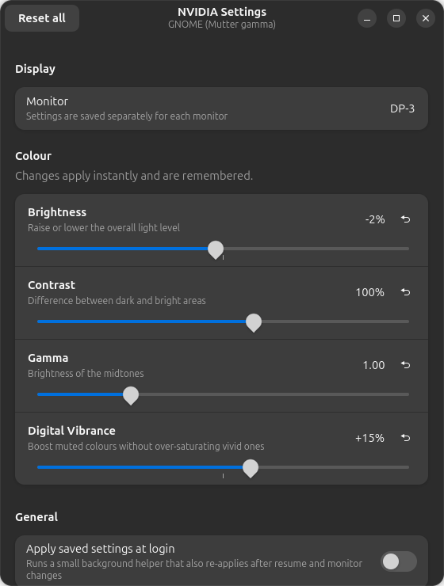

<div align="center">


# nvpanel

**NVIDIA Control Panel-style display settings for Linux.**
Brightness · Contrast · Gamma · Digital Vibrance — with a GTK4/libadwaita app, a CLI and settings that survive reboots.


</div>

<div align="center"></div>

---

## Why

On Windows you open the NVIDIA Control Panel and drag *Digital Vibrance* up. On Linux, `nvidia-settings` can do that only on X11, and does nothing on Wayland. nvpanel gives you the same sliders on **both**:

| Session | Brightness | Contrast | Gamma | Digital Vibrance |
|---|:---:|:---:|:---:|---|
| **GNOME on Wayland** | ✅ | ✅ | ✅ | ✅ software shader via bundled Shell extension |
| **X11** (any desktop) | ✅ | — | ✅ | ✅ hardware, via `nvidia-settings` |

> **Honest status**
> - GNOME/Wayland: brightness, contrast and gamma are tested on an RTX 3060 Ti (driver 595, GNOME Shell 50, Ubuntu).
> - The Wayland vibrance shader was verified in a headless GNOME Shell by comparing rendered pixels. Behaviour in **fullscreen games** is still being checked (see [Known issues](#known-issues)).
> - The **X11 backend is untested** on real hardware so far — it is small and should work, bug reports are very welcome.
> - KDE Plasma/Wayland and wlroots compositors (Sway, Hyprland) have no backend yet — see [Contributing](#contributing).

## Install

Clone and run the installer. It installs the dependencies for your distro and puts `nvpanel` in `~/.local` (no pip, no root for nvpanel itself):

```bash
git clone https://github.com/erenkda/nvpanel.git
cd nvpanel
./install.sh            # add --no-deps to skip the package-manager step
nvpanel
```

Supported by the installer (package names for the other distros are **untested**, please report problems):

| Distro | Packages installed |
|---|---|
| **Ubuntu / Debian / Mint / Pop!_OS** | `python3-gi gir1.2-gtk-4.0 gir1.2-adw-1 x11-xserver-utils nvidia-settings` |
| **Fedora** | `python3-gobject gtk4 libadwaita xrandr nvidia-settings` (RPM Fusion) |
| **Arch / Manjaro / EndeavourOS / CachyOS** | `python-gobject gtk4 libadwaita xorg-xrandr nvidia-settings` — or build [`packaging/arch/PKGBUILD`](packaging/arch/PKGBUILD) |
| **openSUSE** | `python3-gobject typelib-1_0-Gtk-4_0 typelib-1_0-Adw-1 xrandr nvidia-settings` |

Manual run without installing: `python3 nvpanel.py`. Remove with `./uninstall.sh`.

### Digital Vibrance on GNOME / Wayland

```bash
nvpanel --install-extension     # installs + enables the GNOME Shell extension
# log out and back in once, then restart nvpanel
```

## Usage

```bash
nvpanel                         # GUI
nvpanel --list                  # backend, capabilities, monitors
nvpanel --set brightness=5 contrast=110 gamma=1.2 vibrance=30
nvpanel --set vibrance=20 --monitor DP-3
nvpanel --reset                 # back to defaults
nvpanel --apply                 # apply saved settings once
nvpanel --daemon                # apply, then re-apply on monitor change / resume
```

The **“Apply saved settings at login”** switch in the GUI creates an autostart entry running `--daemon`. Settings are stored per monitor in `~/.config/nvpanel/config.json`.

| Setting | Range | Default |
|---|---|---|
| Brightness | −50 … +50 % | 0 |
| Contrast | 30 … 150 % | 100 |
| Gamma | 0.4 … 2.8 | 1.0 |
| Digital Vibrance | −100 … +100 % | 0 |

## How it works

```
GUI / CLI ──► backend ──► GNOME Wayland : Mutter D-Bus gamma LUT   (brightness, contrast, gamma)
                     │                  + Shell extension shader  (vibrance)
                     └──► X11           : xrandr                   (brightness, gamma)
                                          nvidia-settings          (vibrance)
```

- Backends live in [`nvpanel/backends/`](nvpanel/backends). Each exposes `available()`, `monitors()`, `apply()` and a `capabilities` set; the GUI enables only the sliders a backend supports.
- The vibrance shader boosts muted colours more than already-vivid ones (so skin tones and bright UI don't blow out); negative values desaturate.

## Known issues

- **Vibrance on Wayland is software-based** and applies to the whole desktop, not per monitor.
- Fullscreen games: compositor effects may add latency or be bypassed by direct scanout. Not yet measured.
- X11 backend: contrast is unavailable (`xrandr` has no contrast control).

## Contributing

Issues and PRs are welcome — especially:

- testing the **X11 backend** and the distro install paths,
- a **KDE Plasma (KWin)** backend and a **wlroots** backend (`wlr-gamma-control`),
- packaging (`.deb`, `.rpm`, Flatpak, AUR).

A new backend is one file in `nvpanel/backends/` implementing the `Backend` interface.

## License

[MIT](LICENSE)
